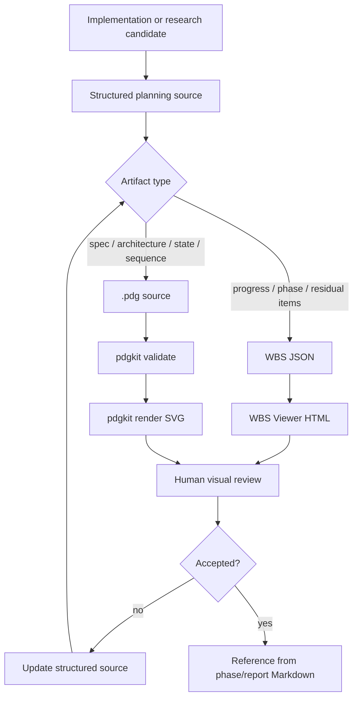

# Implementation Plan For Items 11 And 35

Date: 2026-06-22

Inputs:

- `.codex/chatgpt-control/x-url-analysis-20260622/current-decision-summary.md`
- `.codex/chatgpt-control/x-url-analysis-20260622/project-usability-review.md`
- `.codex/chatgpt-control/x-url-analysis-20260622/chatgpt-visible-output.txt`
- Item 11 source candidate: `https://github.com/piguo45/single-file-wbs`
- Item 35 source candidate: `https://github.com/shibayamalicht/pdgkit`

## Status

This is a second-wave implementation planning artifact for items 11 and 35. It supersedes the older
residual judgment that treated item 11 as only conditional and item 35 as dormant for this X/GPT
flow.

It is not permission to install npm packages, enable MCP servers, configure hooks, call providers,
or promote ChatGPT/X-derived material into citation-ready evidence. Source review, pinning, local
canary results, and explicit adoption gates still apply.

## Planning Principle

The useful shared direction is not "make prettier diagrams." The direction is:

1. keep plans and diagrams as structured source files;
2. let humans inspect them visually;
3. let Codex edit the structured source deterministically;
4. validate before rendering;
5. keep generated visuals as review artifacts, not evidence.

Item 11 owns operational plan/progress visibility. Item 35 owns deterministic specification and
diagram rendering. They should be evaluated together as a visual-coding foundation, but implemented
through separate gates because their dependency and maintenance profiles differ.

## Candidate Split

| # | Candidate | Revised role | First local outcome |
|---:|---|---|---|
| 11 | WBS Viewer / `single-file-wbs` | Adopt as the first visual planning surface candidate. | Vendored, pinned viewer plus `research_x` WBS JSON export canary. |
| 35 | `pdgkit` | Evaluate as a deterministic diagram/spec renderer. | Source review plus `.pdg -> validate -> SVG` canary; no MCP enablement yet. |

## P0: Shared Local Artifact Contract

Purpose: prevent WBS and diagram outputs from becoming hand-edited screenshots or unreviewable
assistant prose.

Work packages:

1. Define an artifact boundary.
   - Source files: JSON for WBS, `.pdg` for pdgkit, Markdown for human narrative.
   - Rendered files: HTML/SVG/PNG/PDF/PPTX are generated review artifacts.
   - Evidence boundary: generated visuals can explain decisions but cannot replace source bundles,
     traces, source URLs, tests, or phase-gate records.

2. Define provenance fields.
   - `source_candidate`: item number and upstream URL.
   - `upstream_ref`: tag, release, or commit used for review.
   - `generated_from`: local structured source path.
   - `review_status`: `draft`, `canary`, `accepted`, `rejected`, or `archived`.

3. Define output locations.
   - Planning canaries should stay under `.codex/chatgpt-control/x-url-analysis-20260622/` until
     accepted.
   - Durable project behavior should move to an explicit repo surface only after a later accepted
     implementation phase.

Do not:

- treat generated diagrams as project evidence;
- put transient X/GPT review material into `docs/memory-pipeline-v2.md`;
- enable third-party MCP or hooks during this planning phase.

## P1: Item 11 WBS Viewer Adoption Canary

Reason for priority:

- The current 35-item flow already produced an observability gap: remaining candidates, first-wave
  outcomes, second-wave candidates, and NO-GO reasons became hard to inspect from Markdown alone.
- WBS Viewer is closer to day-to-day project operation than pdgkit. It maps directly to phase,
  task, planned/actual, progress, and delay visualization.
- The upstream design is unusually aligned with Codex workflows: single HTML, JSON source, local
  operation, AI-readable maintenance instructions, and no build/server requirement for viewing.

Implementation steps:

1. Source review and pinning.
   - Record license, upstream tag or commit, files copied, and known browser/runtime constraints.
   - Confirm no network/provider behavior is required for viewing.
   - Confirm whether vendoring `wbs_viewer.html`, sample JSON, and upstream instructions is
     acceptable under the license.

2. Vendored copy, disabled-by-default.
   - Copy upstream viewer into a clearly named vendor or tool folder only after source review.
   - Preserve upstream license and provenance.
   - Do not edit upstream copy directly for the first canary.

3. Generate `research_x` WBS JSON for this X/GPT flow.
   - Include all 35 items as tasks or grouped child tasks.
   - Include Phase 1-8 outcomes as completed or closed tasks.
   - Include item 11 and 35 as second-wave active tasks.
   - Use notes or custom fields for source URL, decision band, gate, blocking reason, and local
     artifact links.

4. Visual review canary.
   - Open the viewer locally against the generated JSON.
   - Check that a user can answer these without reading five Markdown files:
     - what is complete;
     - what is still active;
     - what is provider-gated or closed;
     - what is blocked by source review, dependency review, or missing requirement;
     - what changed when item 11 and 35 were promoted.

5. Decide whether to fork/customize.
   - If JSON custom fields and notes are enough, keep upstream unchanged.
   - If `research_x` needs first-class columns for `gate`, `decision_band`, `source_url`,
     `evidence_file`, or `next_action`, fork into a project-owned viewer.

Do not:

- turn the viewer into the source of truth for architecture;
- put private secrets, credentials, or provider keys into WBS JSON;
- require a browser editing flow for Codex updates; Codex should edit the JSON source directly;
- overwrite upstream files with project-specific changes unless the fork decision is explicit.

P1 acceptance criteria:

- A pinned source-review note exists.
- A WBS JSON canary renders the current 35-item flow.
- The rendered view improves inspection of phase status without replacing Markdown records.
- The adoption decision is one of: `keep vendored viewer`, `fork/customize`, `reference only`, or
  `reject`.

## P2: Item 35 pdgkit Standalone Evaluation

Reason for separate evaluation:

- pdgkit is not a progress tracker. It is a deterministic `DSL -> validate -> render` pipeline for
  specification diagrams.
- It should be judged against Mermaid and plain Markdown, not against WBS Viewer.
- Its value is highest when Codex needs repeatable block diagrams, flowcharts, state transitions,
  sequence diagrams, or specification figures that should not be hand-drawn by the model.

Implementation steps:

1. Source review and dependency boundary.
   - Review license, font license, npm package name, Node version requirement, CLI behavior, test
     surface, network/privacy claims, and MCP server surface.
   - Treat npm install, npx, and MCP enablement as explicit gates. Do not run them as part of this
     plan unless a later task authorizes dependency evaluation.

2. Choose canary diagrams.
   - Canary A: convert the item 11/35 decision flow into a `.pdg` flowchart.
   - Canary B: convert one existing memory-workflow route into a `.pdg` block or sequence diagram.
   - Canary C: convert a small state machine such as `draft -> canary -> accepted/rejected ->
     archived`.

3. Evaluate against Mermaid.
   - Use Mermaid when the diagram is primarily documentation and the existing Markdown renderer is
     sufficient.
   - Prefer pdgkit only if validation diagnostics, stable SVG output, reference labels, or
     code/CLI integration clearly improves review.

4. Local canary execution, if approved later.
   - Install or run pdgkit only in an isolated, pinned dependency review step.
   - Run `validate` before `render`.
   - Save the `.pdg` source and rendered SVG together.
   - Record whether SVG output is deterministic across repeated runs.

5. Adoption decision.
   - `GO`: add a project-owned `.pdg` artifact lane for selected spec diagrams.
   - `LIMITED`: keep pdgkit for patent-like, block, state, sequence, or flow diagrams only.
   - `REFERENCE`: keep the validate/render pattern but do not add the dependency.
   - `NO-GO`: reject if the patent-specific DSL is too narrow or dependency value is lower than
     Mermaid/local HTML rendering.

Do not:

- enable `pdgkit-mcp` during the first evaluation;
- use generated pdgkit output as evidence;
- replace Mermaid diagrams that are already sufficient;
- create a general "diagram everything" requirement.

P2 acceptance criteria:

- Source/dependency review is recorded.
- At least one `.pdg` canary source is drafted.
- Mermaid comparison is explicit.
- The decision is `GO`, `LIMITED`, `REFERENCE`, or `NO-GO` with a named reason.

## P3: Integration Flow If Both Pass

If P1 and P2 both pass, use a two-lane artifact flow:

Integration rule:

- WBS answers "what is the project state?"
- pdgkit answers "what is the structure or behavior?"
- Markdown answers "why was the decision made?"

## Recommended Execution Order

1. Update the current X/GPT decision summary to point at this second-wave plan.
2. Perform item 11 source review and pin upstream WBS Viewer.
3. Generate a WBS JSON canary for the 35-item flow.
4. Review the WBS view and decide vendored-upstream vs fork/customize.
5. Perform item 35 source/dependency review for pdgkit.
6. Draft `.pdg` canaries without enabling MCP.
7. If dependency evaluation is approved, run validate/render locally and compare with Mermaid.
8. Record final adoption decisions and promote only accepted local artifact behavior.

## Stop Gates

Stop before:

- npm install, npx, or dependency lockfile changes;
- MCP server enablement or client registration;
- browser/file-system editing flows that write outside the intended workspace;
- provider/API/search/Reader/managed-RAG calls;
- copying third-party code without license/provenance notes;
- treating generated visuals as evidence;
- promoting this transient X/GPT plan into durable architecture docs without a verified
  implementation decision.

## Done Criteria For This Planning Phase

- Item 11 is promoted from vague conditional handling to a concrete WBS Viewer adoption canary.
- Item 35 is separated from WBS and evaluated as its own deterministic diagram renderer candidate.
- Both items have source-review, local canary, acceptance, and stop gates.
- The plan distinguishes vendoring, forking, dependency evaluation, and MCP enablement.
- The plan can start under the no-quota/provider freeze without external provider use.
