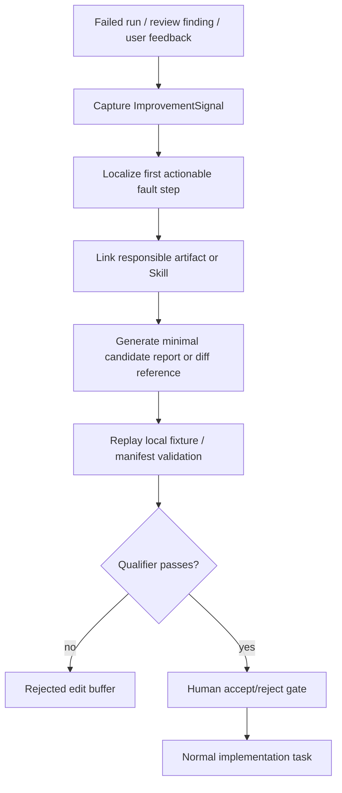
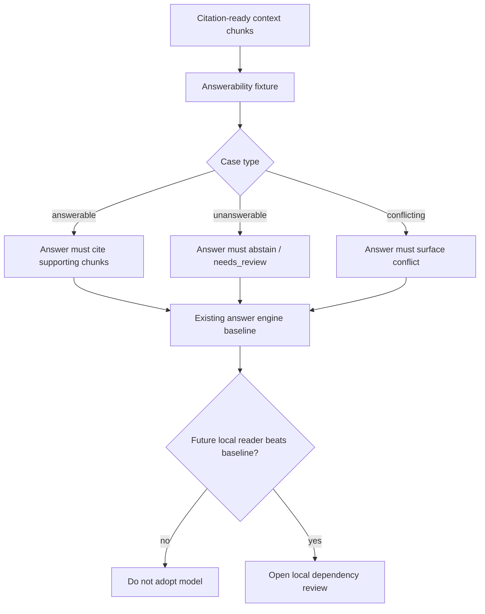
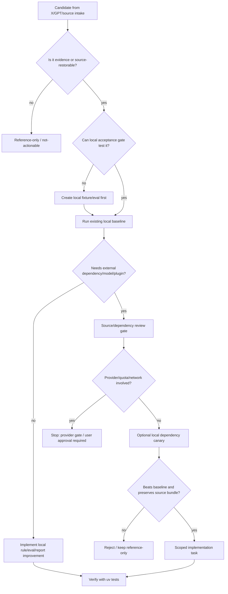

<!-- Historical consultation capture. Active path: README.md, tools/wbs_viewer/projects/research-x-work-state.json, docs/pdg/*.pdg, and .codex/context_offloads/pointer-map.json. Not evidence; do not update as an active tracker. -->

# Implementation Priority Flow

Date: 2026-06-22
Inputs:

- `.codex/chatgpt-control/x-url-analysis-20260622/project-usability-review.md`
- `.codex/chatgpt-control/x-url-analysis-20260622/chatgpt-opaque-deferred-followup.md`

## Status

This is an implementation planning artifact, not a durable architecture decision. It should not be
copied into `docs/memory-pipeline-v2.md` or `PROJECT.md` until a specific phase is accepted and
implemented.

Post-execution status is recorded in
`.codex/chatgpt-control/x-url-analysis-20260622/phase-gate-report.md`. The current residual
35-item decision after Phase 1-8 is recorded in
`.codex/chatgpt-control/x-url-analysis-20260622/current-decision-summary.md`.

No provider/API calls, installs, plugin enables, MCP configuration changes, or third-party Skill
adoptions are authorized by this plan. The no-quota freeze remains active.

## Planning Principle

Some deferred items are not rejected; they are lower-priority because they depend on missing gates.
The implementation order should therefore be gate-first:

1. Add local acceptance/eval surfaces that make promotion measurable.
2. Use those surfaces to test high-value candidates without installing or calling providers.
3. Only after a candidate wins locally, consider source review, dependency review, or provider gate.

This avoids treating "not now" as "never" while also avoiding premature adoption.

## Priority Classes

### P0: Shared Gates Before Candidate Adoption

Purpose: make future promotions auditable.

Implement first because it supports multiple candidates and has no external dependency.

Work packages:

1. ImprovementSignal qualifier fields
   - Owner surface: `src/research_x/codex_improvement/pipeline.py`,
     `tests/test_codex_improvement.py`.
   - Add proposal-only fields for `fault_step`, `responsible_artifact`, `candidate_diff_ref`,
     `replay_result`, `qualifier_result`, and `human_decision`.
   - This is the local part of the SkillAdaptor idea.
   - Gate: no automatic Skill rewrite; generated changes remain proposal-only.

2. Answerability fixture lane
   - Owner surface: `src/research_x/memory/answer.py`,
     `src/research_x/memory/workflow.py`, existing memory tests.
   - Add fixtures for answerable, unanswerable, and conflicting-evidence cases.
   - This is the local acceptance gate for OCC-RAG-style readers.
   - Gate: fake/local answer engine first; no model download.

3. Relevance / support fixture lane
   - Owner surface: memory eval or portfolio tests.
   - Add fixture shape for relevance, duplicate, conflict, and citation-support judgments.
   - This is the local acceptance gate for Hanno-Lab Bosun or any relevance checker.
   - Gate: deterministic/fake scoring first; no local model dependency yet.

4. Vector backend benchmark skeleton
   - Owner surface: `src/research_x/memory/vector_projection.py` and CLI/test harness around it.
   - Compare current SQLite/FTS/relation/local projection/Turbovec surfaces before adding Zvec.
   - Gate: define corpus, latency, recall, cold start, update/delete, memory, and source-restoration
     measures before importing a new backend.

5. Route-level context policy fixture
   - Owner surface: context budget/workflow eval tests.
   - Compare full-history, summary, offload, and stale-observation masking by route.
   - This absorbs stale observation masking as an eval warning, not a global rule.

Output of P0:

- Local tests/evals that can reject bad promotions.
- No third-party runtime added.
- No provider usage.

## P1: Highest-Value Local Implementation

### P1-A: SkillAdaptor Pattern Into ImprovementSignal

Reason for first implementation:

- High leverage across all Codex/repo Skill work.
- No model/provider/dependency needed for the first version.
- Existing `ImprovementSignal` is already proposal-only, so the safety boundary matches.

Flow:

Implementation steps:

1. Extend the data model and validation.
2. Extend deterministic triage output.
3. Add candidate-report sections for replay and qualifier.
4. Add tests proving no auto-apply path exists.

Do not:

- install SkillAdaptor;
- auto-edit Skills;
- add broad self-improvement behavior to `AGENTS.md`.

## P2: Memory Answer And Evidence Quality Gates

### P2-A: OCC-RAG-Shaped Answerability Fixture

Reason for second:

- Directly improves evidence quality.
- Does not require OCC-RAG model adoption.
- Creates a promotion gate for any future local reader/checker.

Flow:

Implementation steps:

1. Add fixture records for answerable/unanswerable/conflicting evidence.
2. Assert status/citation behavior on fake/local answer paths.
3. Add a report field that records answerability outcome separately from retrieval.

Do not:

- treat OCC-RAG as a retriever;
- download model weights in this phase;
- promote generated answers as evidence.

### P2-B: Hanno-Lab Bosun-Shaped Relevance Fixture

Reason:

- It was newly clarified as a plausible local-eval candidate.
- It can share fixture structure with citation-support and conflict detection.

Implementation steps:

1. Define judgment fixture rows: relevant, irrelevant, duplicate, conflict, supports_claim,
   does_not_support_claim.
2. Add deterministic baseline scoring.
3. Add a future adapter slot named generically, such as `local_judge_candidate`, not `bosun` yet.

Do not:

- download or run Bosun in this phase;
- add a model-specific contract before local fixture value is proven.

## P3: Retrieval And Route Efficiency

### P3-A: SAAS / Stop-Condition Audit

Reason:

- It is useful now, but narrow.
- It should become an audit metric, not an RL import.

Implementation steps:

1. Record `searched_after_sufficient_evidence`, `redundant_search_count`, and `stop_reason`.
2. Add tests for "do not escalate after enough local evidence" cases.
3. Add route summary lines to workflow/eval reports.

### P3-B: Stale Observation Masking Eval

Reason:

- GPT Pro follow-up clarified that this is a route-dependent eval warning.
- It should not be an always-on masking policy.

Implementation steps:

1. Build fixture variants: full history, summarized history, offloaded history, masked history.
2. Compare citation-ready yield, unsupported context, and answer status.
3. Allow route-specific masking only if it wins locally.

## P4: Local Backend Candidate Gate

### P4-A: Zvec Benchmark Stub

Status: implemented as a local benchmark gate. Zvec remains dependency-review required and is not
installed, imported, or promoted as a default backend. Benchmark query embeddings are limited to
`local_hash` while the provider freeze is active.

Reason:

- Zvec may be useful, but its only acceptable promotion path is benchmark evidence.
- Current repo already has local vector projection with `numpy` and optional `turbovec`.

Implementation steps:

1. Add benchmark harness inputs and result schema without importing Zvec.
2. Run current backends first.
3. Define acceptance thresholds for latency, recall, cold start, update/delete, disk/memory, and
   source-bundle restoration.
4. Only then open a dependency/source review for Zvec.

Do not:

- add Zvec as a default backend;
- treat Zvec as managed vector DB replacement;
- install native dependencies before the benchmark harness exists.

## P5: Source Review, Not Implementation

### P5-A: Agentmemory Source Review

Status: completed as a disabled source-lock decision. Agentmemory is not installed, enabled, or
wired into hooks/MCP/plugin config; it remains a source-review-required comparison target.

Reason:

- It is not an implementation priority, but it is worth reviewing after local gates exist.
- Its hook/MCP/auto-capture model is invasive and overlaps existing local memory surfaces.

Review checklist:

- pinned version;
- local-only / zero-network behavior;
- hooks and lifecycle actions;
- secret redaction;
- retention/deletion;
- source-bundle compatibility;
- baseline comparison against current memory/handoff/planning files.

Outcome choices:

- reject;
- reference-only;
- source-review candidate;
- future MCP/plugin candidate.

Do not install during this flow.

## P6: Renderer And Observability Patterns

These are not first implementation priorities unless a concrete observability or artifact problem
appears.

Candidates:

- YAML-to-HTML structure/view split;
- WBS/progress visualization;
- Archify;
- pdgkit.

Preferred order if needed:

1. Define project-owned JSON/YAML schema.
2. Add deterministic local renderer.
3. Add validation/golden output tests.
4. Only then compare external tools.

Do not:

- install Archify or pdgkit as Skills/MCPs without source review;
- treat generated diagrams as evidence;
- add visualization before a real trace/observability gap exists.

## P7: Explicitly Deferred

Do not implement now:

- Visual Skills / AutoVisualSkill: wait for a UI/browser/media failure where spatial evidence is
  central, then define screenshot provenance/redaction/verification first.
- JAMEL: wait for a GUI/browser exploration objective with measurable coverage/novelty.
- RAG Knowledge Hub: keep as reference only because of hosted services, extraction rights, and
  example/hackathon status.
- Ontology mention: no action until original context or source is restored.
- Devin/Manus mention: no action unless a separate vendor/provider evaluation is requested.
- Firecrawl, Google Agentic RAG, Bedrock AgentCore, hosted search/RAG providers: provider-gated and
  outside the no-quota freeze.

## End-To-End Flow

## Recommended Execution Order

1. P1-A: SkillAdaptor pattern into `ImprovementSignal`.
2. P2-A: OCC-RAG-shaped answerability fixtures.
3. P2-B: Hanno-Lab Bosun-shaped relevance/support fixtures.
4. P3-A: SAAS-style stop-condition audit.
5. P3-B: stale observation masking route eval.
6. P4-A: Zvec benchmark stub over existing local backends.
7. P5-A: Agentmemory source review.
8. P6 renderer/observability pattern only if a concrete UI/report gap appears.

This order intentionally places local governance and eval gates before local model/backend
experiments. The main reason is that OCC-RAG, Bosun, Zvec, and Agentmemory all become safer and
easier to judge once the fixture/reporting surfaces exist.

## Stop Gates

Stop before:

- provider/API/search/Reader/managed-RAG calls;
- model downloads;
- dependency installs;
- plugin/MCP/hook enablement;
- third-party Skill installation;
- automatic Skill edits;
- architecture-doc promotion without verified source intake.

## Done Criteria For This Planning Phase

- The plan separates lower-priority-but-possible items from true rejects.
- Each implementable item has a local first step.
- External dependencies are behind explicit gates.
- The first implementation phase can proceed without network/provider quota.
