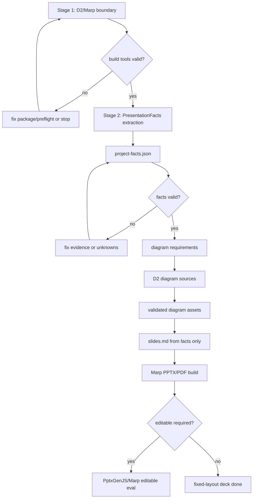

# research_x presentation generation implementation priority flow

Date: 2026-06-24
Source: ChatGPT visible web consultation
Thread: https://chatgpt.com/c/6a3bb144-14f0-83e8-8229-039862aa8e68
Evidence status: not_evidence; planning/control artifact only.

## Inputs

- ChatGPT thread `https://chatgpt.com/c/6a3bb144-14f0-83e8-8229-039862aa8e68`
  titled `PPTX自動生成方法`; consultation output, not project evidence.
- `README.codex.md`; repository read path and canonical pointer rules.
- `PROJECT.md`; evidence invariant, active gates, and Markdown/WBS placement rules.
- `tools/wbs_viewer/projects/research-x-work-state.json`; current operational state,
  not evidence.
- Local checks on 2026-06-24: `d2` is not on PATH, root `package.json` is absent,
  `node.exe` is present, and `outputs/research-x-project-pipeline-overview-2026-06-24.pptx`
  is an untracked generated output.

## Status

This plan was updated after the user chose to do the missing build-tool boundary
first. Stage 1 is now the repo-local D2/Marp/root package boundary. The
previously generated facts-first presentation workflow is preserved and promoted
to Stage 2.

This is still not authorization for PptxGenJS, Structurizr, DBML, PlantUML,
Repomix, plugins, hooks, MCP servers, provider-backed generators, or unrelated
dependency adoption.

The ChatGPT recommendation is useful as consultation: start with `Codex ->
project-facts.json -> diagrams -> slides -> PPTX`, keep one facts source of truth,
and defer multi-DSL complexity. For this repository, that recommendation must be
adapted to existing local owners:

- Facts and claim backing belong in `docs/presentation/project-facts.json`.
- Operational state belongs in WBS, not long Markdown.
- D2 and Marp are now the Stage 1 dependency boundary to make explicit before
  facts, diagrams, slides, and PPTX generation.
- Generated PPTX, SVG, HTML, WBS, pointer maps, and ChatGPT output remain
  control/review/presentation artifacts, not evidence or answer support.

## Planning Principle

Separate the build-tool boundary from the presentation-content boundary. Stage 1
establishes a repeatable local D2/Marp build surface. Stage 2 then uses the
facts-first workflow so deck content still comes from reviewed repository facts,
not from raw guesses or generated PPTX.

Every renderer and DSL remains replaceable; `project-facts.json` is the first
durable content boundary.

## Stage Boundary Update

Stage 1 owns only the build-tool boundary:

- choose the repo-local package surface;
- decide how D2 and Marp are invoked;
- create or update lockfiles/scripts only for that selected surface;
- prove the CLIs can run without provider calls, plugins, hooks, or MCP.

Stage 2 owns the previously drafted presentation workflow:

- `PresentationFacts` schema and validator;
- `project-facts.json` extraction;
- diagram requirements from facts;
- slide Markdown from facts;
- PPTX/PDF build smoke after the renderer is available.

Do not use Stage 1 to generate deck claims, facts, diagrams, or slides.

## Priority Classes

### P0: Stage 1 D2/Marp Build-Tool Boundary

Purpose: make the missing build-tool surface explicit before the facts-first deck
workflow starts.

Owner surfaces:

- root `package.json` and lockfile, if the Node-based Marp build lane is chosen;
- `docs/presentation/build.ps1` or `docs/presentation/build.sh`;
- `docs/presentation/presentation.config.yaml`;
- WBS leaf `Stage 1 D2/Marp dependency boundary`.

Work packages:

1. Select the smallest repeatable repo-local build lane:
   - Marp CLI through a root Node package;
   - D2 through an explicit local install path or documented preflight;
   - no fallback diagram DSL for the presentation workflow.
2. Add a script/preflight that reports:
   - Node availability;
   - Marp CLI availability;
   - D2 CLI availability;
   - output directories;
   - no provider/API/browser/plugin/MCP requirement.
3. If package files are added, keep the scope limited to presentation build
   tooling and lock the exact dependency versions.
4. Do not generate factual deck content in Stage 1.

Tests/evals:

- `node --version`
- package-manager lock/install verification only for the selected repo-local
  surface;
- D2/Marp CLI help or version checks;
- a no-content smoke that proves the build script fails clearly when facts/slides
  are absent.

Do not:

- add PptxGenJS, Structurizr, DBML, PlantUML, Repomix, plugins, hooks, MCP, or
  provider-backed generators;
- run provider/API/search/Reader/OCR/LLM/model calls;
- treat `npx` package download as a hidden runtime dependency; if using Marp,
  make it explicit in the package surface;
- create slides or diagrams from raw repository guesses.

Expected output:

- repeatable local build-tool boundary for D2/Marp;
- explicit preflight result that Stage 2 can depend on.

### P1: Stage 2 Shared Content Gates

Purpose: prevent "plausible deck from raw guesses" once the build-tool boundary
exists.

Owner surfaces:

- `docs/presentation/project-facts.schema.json`
- `docs/presentation/project-facts.json`
- `docs/presentation/presentation.config.yaml`
- `tests/test_presentation_facts.py`
- WBS leaf `Stage 2 Presentation facts and slides flow`

Work packages:

1. Define a `PresentationFacts` JSON contract with:
   - project name, one-liner, purpose, audience, and scope;
   - tech stack and runtime surfaces;
   - entrypoints, modules, boundaries, data stores, and external dependencies;
   - key flows with source files;
   - database section with `exists` and tables;
   - `claims[]` with `claim`, `evidence[]`, and `slide_candidate`;
   - `unknowns[]` for anything not supported by repository files.
2. Add deterministic validation that rejects:
   - slide claims without repository-file evidence;
   - generated artifacts used as evidence;
   - facts copied from README when code contradicts current implementation;
   - `unknowns` silently promoted to deck claims.
3. Treat current untracked PPTX output as an example artifact only. Do not use it
   as facts, evidence, or source of truth.

Tests/evals:

- `uv run pytest tests/test_presentation_facts.py`
- schema fixture tests for valid facts, missing evidence, unknown promotion, and
  generated-artifact evidence rejection.

Do not:

- generate slides before facts validation exists;
- expand Stage 1 dependency scope while implementing Stage 2;
- edit `AGENTS.md` or create a Skill for this one workflow unless it becomes
  recurring and passes Skill hygiene.

Expected output:

- a local facts contract that can be reviewed independently from any renderer.

### P2: Stage 2 Facts Extraction Implementation

Candidate band: `use-now`.

Implement the first runnable lane as:

```text
repository files -> PresentationFacts extraction -> project-facts.json
```

Owner surfaces:

- `src/research_x/presentation/facts.py`
- `src/research_x/presentation/validate.py`
- `tests/fixtures/presentation/`
- `tests/test_presentation_facts.py`
- `docs/presentation/project-facts.json`

Implementation steps:

1. Add a small presentation module that can load, validate, and summarize
   `project-facts.json`.
2. Start with manual or Codex-assisted extraction, not a provider-backed
   summarizer.
3. Record each important claim with repository file pointers.
4. Put uncertain or stale-README items into `unknowns`.
5. Keep generated deck files out of the facts contract.

Tests/evals:

- validation unit tests;
- a fixture that proves generated PPTX/SVG/HTML paths cannot satisfy
  `claims[].evidence`;
- optional CLI smoke through `uv run python -m research_x ...` only after a
  command surface is chosen.

Do not:

- call OpenAI, Gemini, Reader, OCR, external search, or LLM-context providers;
- treat ChatGPT consultation links as evidence;
- modify application source code outside the presentation module.

Done criteria:

- `project-facts.json` can be validated locally;
- every slide-worthy claim has file evidence or is explicitly unknown;
- no renderer is required to inspect or approve facts.

### P3: Stage 2 D2 Diagram Lane

Candidate band: `use-now-narrow` after Stage 1 succeeds; otherwise
`local-dependency-candidate`.

ChatGPT recommends D2 as the single diagram DSL. After Stage 1, D2 should either
be available through the selected local build surface or remain explicitly
blocked. Therefore:

- use D2 only after Stage 1 validates the CLI path;
- never split diagrams across D2, DBML, PlantUML, and Structurizr at the
  same time for a first deck.

Owner surfaces:

- `docs/presentation/diagrams/*.d2` for deck diagram sources;
- `docs/presentation/assets/*.svg` for generated review/presentation assets;
- `docs/presentation/slides.md` only after facts and diagrams exist;
- the Stage 1 D2 package/script surface for validation/rendering.

Implementation steps:

1. Derive diagram requirements from `project-facts.json`, not from raw memory.
2. Create deck-specific D2 sources under `docs/presentation/diagrams/`.
3. Keep architecture, main flow, and ERD diagrams in D2 unless Stage 2 proves a
   different renderer is necessary.
4. Validate/render through the Stage 1 D2 lane before embedding assets.
5. Store rendered assets as presentation/review artifacts only.

Tests/evals:

```powershell
d2 docs\presentation\diagrams\<diagram>.d2 docs\presentation\assets\<diagram>.svg
```

Do not:

- hand-draw a replacement structural diagram;
- install D2 during Stage 2; it belongs to Stage 1;
- treat rendered diagram output as evidence;
- use non-D2 diagram tooling for presentation diagrams.

Done criteria:

- diagram source remains reproducible;
- rendered assets are usable by slides but not promoted to facts or citations.

### P4: Stage 2 Slide Markdown And Build Lane

Candidate band: `use-now-narrow` after Stage 1 succeeds; otherwise
`local-dependency-candidate`.

Marp becomes the first deck renderer only after Stage 1 creates and validates the
repo-local build-tool boundary.

Owner surfaces:

- `docs/presentation/slides.md`
- `docs/presentation/presentation.config.yaml`
- `docs/presentation/assets/`
- later, either `docs/presentation/build.ps1` or `docs/presentation/build.sh`

Implementation steps:

1. Generate `slides.md` from validated facts only.
2. Keep speaker notes or slide comments tied to `claims[].evidence`.
3. Embed only generated diagram assets that came from validated local sources.
4. Add a build script only after choosing the renderer.
5. Use Marp for fixed-layout PPTX/PDF first when the Stage 1 preflight passes.

Tests/evals:

- local validation that every slide claim maps back to a facts claim;
- link/path checks for referenced assets;
- Marp smoke through the Stage 1-approved package/script surface.

Do not:

- bypass the Stage 1 package/script surface with ad hoc `npx` downloads;
- use `--pptx-editable` as the default because it has additional runtime
  requirements;
- add package files only for a one-off deck unless the user wants a repeatable
  build chain.

Done criteria:

- a human-readable slide Markdown draft exists and is traceable to
  `project-facts.json`;
- PPTX generation remains a separate approved build lane.

### P5: Editable PPTX Or Template-Strict Decks

Candidate band: `local-eval-candidate` or `local-dependency-candidate`.

Use this phase only if the output must be editable in PowerPoint or must match a
strict company template.

Options:

- Marp normal PPTX: good for presentation use and visual stability.
- Marp editable PPTX: possible but runtime-heavy and experimental.
- PptxGenJS: better for editable PowerPoint objects, but adds a Node dependency
  and more layout code.
- Codex/desktop presentation runtime: acceptable for one-off artifact creation,
  not a repo-owned repeatable build unless its generated output is checked in by
  explicit user intent.

Do not promote this phase until P0-P4 show that fixed-layout slides are
insufficient.

### P6: Deferred Multi-DSL And Context-Pack Tools

Candidate bands: `reference-only`, `source-review-required`, or
`local-dependency-candidate`.

Deferred items:

- Repomix: use only when sending a repo snapshot to ChatGPT or another external
  model. Codex can already read the local repository.
- Structurizr DSL: add only if long-lived C4 model maintenance becomes a real
  requirement.
- DBML: add only if database schema documentation becomes a durable product
  surface.
- PlantUML: add only if the team already standardizes on UML sequence diagrams
  or D2 cannot express needed sequences.
- D2 outside the Stage 1 boundary: plausible later only if the selected D2 lane
  is insufficient.
- PptxGenJS: plausible for editable decks, but not needed for the first
  facts-first workflow.

Promotion condition:

- name the missing capability;
- prove existing D2/Markdown/Marp output cannot satisfy it;
- pass dependency/source review;
- add local tests before adopting the dependency.

## Explicitly Deferred

True rejects for this plan:

- "PPTX directly from raw repository reading" without a validated facts layer.
- Treating the existing untracked PPTX as source-of-truth.
- Adding multiple diagram DSLs at once.
- Installing or enabling hooks/plugins/MCPs to auto-generate diagrams.
- Creating a repo Skill before this becomes a repeated workflow with clear
  trigger separation.

Deferred but plausible:

- PptxGenJS for editable object-based decks.
- Repomix for external ChatGPT handoff bundles.
- Structurizr/DBML/PlantUML for long-lived specialized documentation surfaces.

## End-To-End Flow

This Mermaid block is a planning illustration only. If this becomes a project
diagram asset, convert it to D2 and keep the `.d2` source as the source of truth.



## Recommended Execution Order

1. Save this plan and register it as not_evidence in the pointer map.
2. Update WBS with Stage 1 and Stage 2 leaves.
3. Implement Stage 1 D2/Marp/root package boundary.
4. Verify Stage 1 with explicit CLI/preflight checks.
5. Implement Stage 2 `PresentationFacts` schema and validation tests.
6. Produce the first `docs/presentation/project-facts.json` from local repository
   files only.
7. Review facts for unsupported claims and unknowns.
8. Create D2 diagram assets from facts.
9. Draft `docs/presentation/slides.md` from facts only.
10. Build fixed-layout PPTX/PDF through the Stage 1-approved Marp lane.
11. Consider PptxGenJS/editable output only if fixed-layout output is
    insufficient.
12. Verify with local tests and renderer-specific smoke checks.

## Stop Gates

- Real provider/API/search/Reader/OCR/LLM/model calls.
- Package install, root dependency adoption, or global CLI install outside the
  Stage 1 D2/Marp boundary.
- PptxGenJS, Repomix, Structurizr, DBML, or PlantUML adoption.
- Plugin, hook, MCP, connector, or automation enablement.
- Automatic Skill creation or AGENTS.md growth without recurring-workflow
  evidence.
- Treating generated PPTX/SVG/HTML/WBS/Pointer/ChatGPT output as evidence.
- Architecture-doc promotion from presentation material.

## Done Criteria For This Planning Phase

- The ChatGPT consultation is named and classified as not evidence.
- Candidate tools are mapped to `use-now`, `local-dependency-candidate`,
  `reference-only`, or rejected states.
- Every promoted item has a local first step and verification path.
- D2/Marp adoption is isolated into Stage 1.
- PptxGenJS and other DSL/tool adoption remains deferred.
- The Stage 2 implementation unit remains clear: `PresentationFacts` schema +
  validator + tests before factual deck generation.
